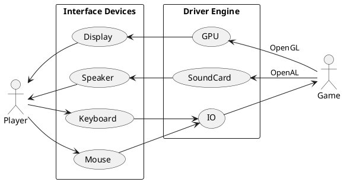

# UML

## 現実の旋盤のシーケンス図

```plantuml
actor User
participant Moter
participant Bite
participant Work

activate User
User -> Moter : Start
activate Moter
Moter -> Work : Rotate
activate Work
User -> Bite : Move
activate Bite
Bite -> Work : Cut
User -> Moter : Stop
deactivate Moter
deactivate Bite
```

## クラス図

```plantuml
class Cylinder{
    radians[]
}
```

## ゲームの一般的な構造


